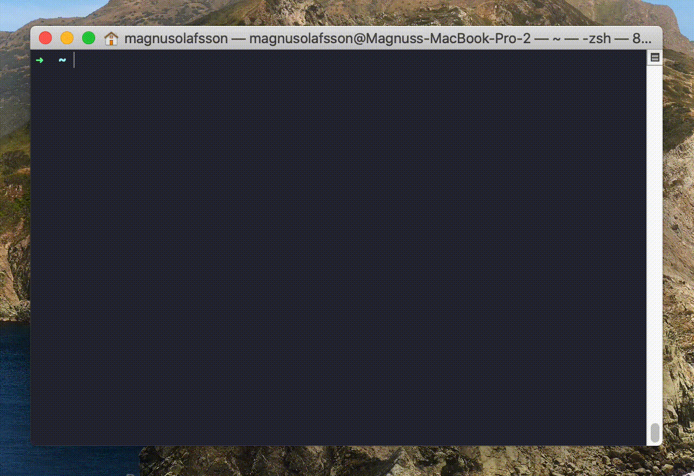

# BashTodo

This is a super simple todo app. You can sort your tasks into projects and sort your task into three columns, _"TODO"_, _"DOING"_ and _"DONE"_. Every created tasks gets automatically assigned an id. Every command that changes a task requires a task ID.

## Commands

- [Init](#init)
- [New project](#new_project-_np_)
- [Switch project](#switch_projects-_sp_)
- [List projects](#projects-_p_)
- [Rename project](#change_current_project-_ccp_)
- [Delete project](#delete_project-_dp_)
- [Create task](#add)
- [Move task to todo](#todo)
- [Move task to doing](#doing)
- [Move task to done](#done)
- [List tasks](#ls)
- [Change task](#change)
- [Delete task](#delete-_del_)

### **init**

Initialize todos.

### **new_project** _np_

_optional argument: <NEW_PROJECT_NAME>_

Creates a new project

### **switch_projects** _sp_

_optional argument: <PROJECT_NAME>_

Switches focus to another project

### **projects** _p_

Lists all projects

### **change_current_project** _ccp_

_optional argument: <NEW_PROJECT_NAME>_

Renames the current project

### **delete_project** _dp_

_optional argument: <PROJECT_NAME>_

Deletes a todo project

### **add**

**argument: <TASK_DESCRIPTION>**

Adds a new task to Todo

### **todo**

**argument: <TASK_ID>**

Moves a task to Todo

### **doing**

**argument: <TASK_ID>**

Moves a task to Doing

### **done**

**argument: <TASK_ID>**

Moves a task to Done

### **ls**

Lists tasks in current project

### **change**

**argument: <TASK_ID>**

Changes task

### **delete** _del_

**argument: <TASK_ID>**

Deletes task

